# Solana Airdrop Free Access Guide

Quick Links: [Overview](#overview) · [Key Benefits](#key-benefits) · [Token Distribution](#token-distribution) · [Eligibility](#eligibility) · [How to Participate](#how-to-participate) · [FAQ](#faq)

---

## Overview

The **Solana Airdrop** is one of the most anticipated events in the crypto community. Designed to boost adoption and encourage participation, this airdrop provides free access to Solana tokens for eligible users. By taking part, you gain an opportunity to experience Solana’s high-speed blockchain ecosystem while contributing to community growth and decentralization.

---

## Key Benefits

* **Free Tokens** 💰 — Gain early access to SOL or project-based tokens.
* **Fast Network** ⚡ — Experience Solana’s near-instant transactions and low fees.
* **Community Growth** 🌐 — Be part of one of the fastest-growing crypto ecosystems.
* **Exclusive Opportunities** 🎯 — Priority access to future launches, NFT mints, and DeFi integrations.

> \[!IMPORTANT]
> Participating in an airdrop is **free**, but always double-check you are using official channels to avoid scams.

---

## Token Distribution

Airdropped tokens are usually allocated based on simple criteria such as wallet holdings, staking activity, or participation in campaigns.

| Distribution Method     | Allocation % | Notes                           |
| ----------------------- | ------------ | ------------------------------- |
| Community Members       | 40%          | Active wallets, past engagement |
| Stakers                 | 30%          | Reward for securing the network |
| Developers & Builders   | 20%          | Incentives for dApp creation    |
| Marketing & Growth Pool | 10%          | Future campaigns                |

*Table designed for clarity; accessibility readers supported.*

---

## Eligibility

To qualify for the Solana Airdrop, participants usually must:

* Hold a **Solana wallet** (Phantom, Solflare, or compatible).
* Complete **community tasks** (Twitter, Discord, Telegram).
* Engage with **staking or liquidity pools**.
* Avoid duplicate or fraudulent wallet entries.

> \[!NOTE]
> Eligibility criteria vary by project. Always review the official announcement.

---

## How to Participate

The participation process is straightforward:

```mermaid
flowchart TD
    A[Visit Official Airdrop Page] --> B[Connect Solana Wallet]
    B --> C[Complete Required Tasks]
    C --> D[Submit Wallet Address]
    D --> E[Wait for Distribution]
    E --> F[Receive Free SOL Tokens 🎉]
```

### Step-by-step:

1. **Set up a wallet**: Install Phantom or Solflare.
2. **Connect wallet**: Go to the official airdrop page.
3. **Complete tasks**: Social engagement or staking.
4. **Claim tokens**: Wait for the distribution window.

---

## Community & Integrations

The Solana ecosystem integrates with:

* **DeFi platforms** (Raydium, Serum)
* **NFT marketplaces** (Magic Eden, Solanart)
* **Wallets & custodians** (Phantom, Ledger, Coinbase Wallet)
* **Bridges & cross-chain tools** (Wormhole)

This strong integration ensures that airdropped tokens have real utility from day one.

---

## FAQ

**Q1: Is the Solana Airdrop really free?**
Yes, airdrops are free. Beware of unofficial sites asking for deposits.

**Q2: How many tokens can I get?**
It varies by campaign, but early adopters often receive higher allocations.

**Q3: Can I sell airdropped tokens immediately?**
Yes, unless tokens are vested or locked for a period.

**Q4: What wallet should I use?**
Phantom is the most user-friendly, but Solflare and Ledger are also supported.

**Q5: How do I avoid scams?**
Always check official announcements and never share your seed phrase.

---

## Final Call to Action

Joining the **Solana Airdrop** is an easy and rewarding way to get involved in one of the most advanced blockchain ecosystems. With free tokens, high-speed transactions, and growing integrations, Solana continues to empower both developers and community members.

---

Would you like me to **expand this into a 1000–1200 word full SEO article** with more in-depth details on participation strategies, risks, and Solana’s future?
